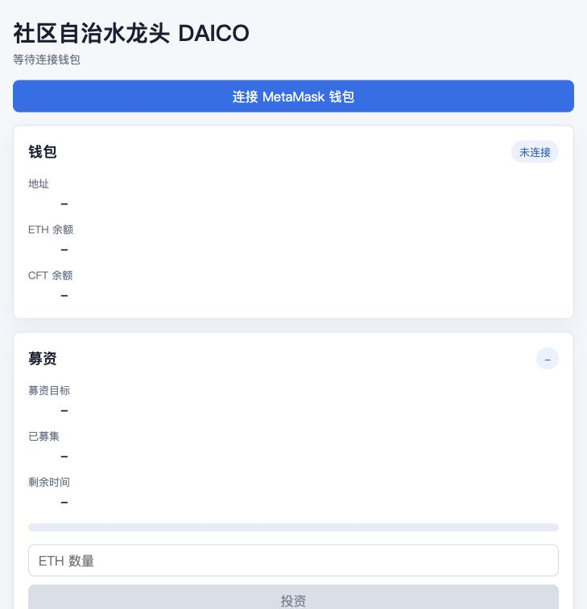
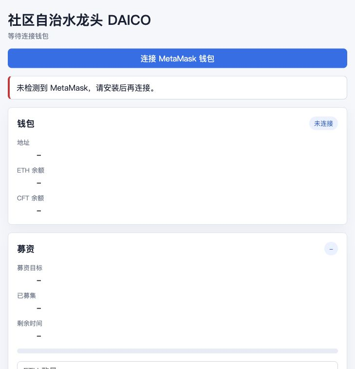
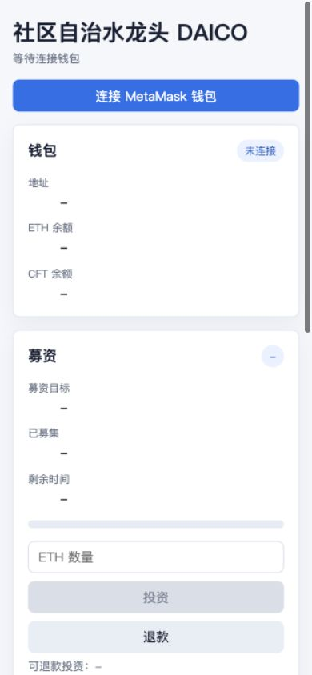

# 社区自治水龙头 DAICO 真实测试报告

测试日期：2026-06-05  
测试对象：题目一“社区自治水龙头 DAICO”本地运行版本  
项目路径：`/Users/wu/Desktop/wu/AAaabaidu/《以太坊 DAICO 开发》考查`

## 结论

本次补做了真实本地浏览器测试，并复跑了链上业务测试。

- 浏览器测试：通过。页面可在本地浏览器打开，首屏非空，主要模块渲染正常，未出现 Vite 或框架错误覆盖层，控制台无 `error` / `warn`。
- 交互测试：通过。点击“连接 MetaMask 钱包”后，当前 Codex In-app Browser 无 MetaMask 环境下正确显示“未检测到 MetaMask，请安装后再连接。”，未连接钱包时投资、退款、水龙头、提案按钮保持禁用。
- 响应式测试：通过。390 x 844 窄屏下页面无横向溢出，钱包、募资、水龙头、治理模块仍可见。
- 合约业务测试：通过。Hardhat 测试覆盖 ERC20、DAICO 募资、退款、水龙头、DAO 提案、投票、执行和金库提款，共 `39 passing`。

重要说明：Codex In-app Browser 本身没有 MetaMask 扩展，因此本次浏览器层没有伪造钱包连接，也没有把模拟钱包当作真实 MetaMask 测试。钱包后的完整链上业务流程由 Hardhat 测试在本地链上真实执行。

## 测试环境

| 项目 | 值 |
| --- | --- |
| 前端地址 | `http://127.0.0.1:5173/` |
| Hardhat RPC | `http://127.0.0.1:8545` |
| Chain ID | `31337` / `0x7a69` |
| Browser | Codex In-app Browser |
| 桌面截图尺寸 | `729 x 757` |
| 移动端视口 | `390 x 844` |
| Token 合约 | `0x5FbDB2315678afecb367f032d93F642f64180aa3` |
| DAICO 合约 | `0xe7f1725E7734CE288F8367e1Bb143E90bb3F0512` |

## 执行命令

```bash
npx hardhat node
npx hardhat run scripts/deploy.js --network localhost
npm run frontend
npx hardhat compile
npx hardhat test
npm --workspace frontend run build
```

## 浏览器验证记录

测试流程：本地页面加载 -> 首屏渲染检查 -> 点击连接钱包 -> 检查无 MetaMask 提示 -> 输入投资金额 -> 检查未连接状态下按钮禁用 -> 切换移动端视口检查响应式。

| 检查项 | 证据 | 结果 |
| --- | --- | --- |
| 页面身份 | URL 为 `http://127.0.0.1:5173/`，标题为“社区自治水龙头 DAICO” | 通过 |
| 非空渲染 | DOM 中包含“钱包”“募资”“水龙头”“DAO 治理”等模块 | 通过 |
| 框架错误覆盖层 | 页面截图和 DOM 未出现 Vite / framework error overlay | 通过 |
| 控制台健康 | `tab.dev.logs({ levels: ["error", "warn"], limit: 50 })` 返回空数组 | 通过 |
| 钱包缺失处理 | 点击“连接 MetaMask 钱包”后显示“未检测到 MetaMask，请安装后再连接。” | 通过 |
| 未连接保护 | 输入 `1` ETH 后，“投资”按钮仍为 disabled | 通过 |
| 响应式 | 390 x 844 下 `scrollWidth = clientWidth = 390`，无横向溢出 | 通过 |

## 链上测试记录

`npx hardhat test` 当前输出：

```text
39 passing (435ms)
```

覆盖范围：

- ERC20 部署、元数据、铸币权限、`approve` / `transferFrom`
- 正常投资、0 金额投资回滚、募资结束后投资回滚
- 募资失败结算、退款、重复退款回滚
- 募资成功结算、金库余额、关闭铸币权限
- 水龙头领取、非持币用户回滚、冷却期重复领取回滚、冷却后再次领取
- 项目方和 5% 持币用户发起提案、低于门槛回滚
- 投支持票、投反对票、无票权回滚、重复投票回滚
- 通过提案执行修改水龙头领取量、冷却时间、开启/关闭水龙头
- 未达参与率、反对票占多数时执行回滚
- DAO 通过后金库提款、超额提款回滚、重复执行回滚
- 提案撤销后禁止继续投票

## 前端构建记录

`npm --workspace frontend run build` 当前输出：

```text
✓ 582 modules transformed.
✓ built in 910ms
```

Vite 输出了 Web3 bundle 大于 500 kB 的常规提示，不影响构建通过。

## 截图证据

桌面首屏：



无 MetaMask 提示：



移动端首屏：



## 未覆盖风险

- Codex In-app Browser 没有 MetaMask 扩展，本次无法在该浏览器内完成真实 MetaMask 授权弹窗和钱包签名交易。
- 未使用真实公网测试网或主网；全部交易验证都在 Hardhat 本地链完成。
- 未测试 Safari、Firefox 或手机真实设备浏览器。
